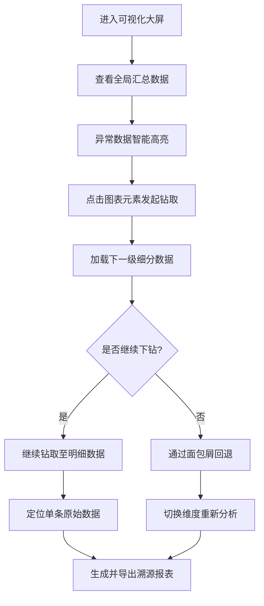

## 1. 产品概述

企业级高阶数据可视化平台，打破传统大屏静态展示局限，支撑运营人员从宏观汇总逐层深挖至单条原始明细数据，实现精细化数据分析。

- 核心目标：解决传统BI大屏只能看汇总、无法深度钻取溯源的痛点
- 目标用户：企业运营人员、数据分析师、业务管理者
- 产品价值：实现"所见即可钻、所钻即可溯"的全链路数据分析能力

## 2. 核心功能

### 2.1 用户角色

| 角色 | 注册方式 | 核心权限 |
|------|----------|----------|
| 运营人员 | 企业账号登录 | 数据查看、钻取分析、筛选导出 |
| 数据分析师 | 企业账号登录 | 高级分析、自定义维度、报表生成 |
| 管理员 | 企业账号登录 | 系统配置、数据管理、权限控制 |

### 2.2 功能模块

1. **可视化大屏**：多图表联动展示、层级钻取导航、全局筛选器
2. **数据钻取**：时间/区域/业务类型三级联动、下钻上卷双向导航
3. **智能分析**：异常数据高亮、同比环比自动计算、多维交叉运算
4. **数据溯源**：汇总数据到明细数据的全链路追溯
5. **报表中心**：定时快照保存、溯源报表导出、自定义报表配置

### 2.3 页面详情

| 页面名称 | 模块名称 | 功能描述 |
|----------|----------|----------|
| 可视化大屏 | 总览仪表盘 | KPI卡片展示核心指标、趋势概览、异常预警 |
| 可视化大屏 | 图表矩阵 | 柱状图、折线图、饼图、地图等多维度展示 |
| 可视化大屏 | 钻取路径 | 面包屑导航展示当前钻取层级、支持快速回退 |
| 数据钻取 | 层级联动 | 点击图表元素触发下一级数据加载、支持反向回滚 |
| 数据钻取 | 维度筛选 | 时间范围、区域选择、业务类型多选联动筛选 |
| 智能分析 | 异常高亮 | 自动识别偏离阈值数据并高亮标记 |
| 智能分析 | 同比环比 | 自动计算同期对比、环比增长数据 |
| 数据溯源 | 明细追溯 | 从汇总数据逐层穿透到单条原始明细 |
| 数据溯源 | 溯源链路 | 可视化展示数据聚合路径和计算逻辑 |
| 报表中心 | 快照管理 | 定时自动保存大屏快照、支持手动保存 |
| 报表中心 | 数据导出 | 导出Excel/PDF格式溯源报表、包含钻取路径 |

## 3. 核心流程

### 3.1 数据钻取分析流程
运营人员进入大屏查看汇总指标 → 关注异常高亮数据 → 点击图表元素触发下钻 → 系统加载细分维度数据 → 继续下钻直至原始明细 → 可随时通过面包屑回退到任意层级 → 导出当前分析路径的溯源报表

### 3.2 流程图

## 4. 用户界面设计

### 4.1 设计风格
- **主色调**：深邃科技蓝 `#0F172A` 作为背景，搭配科技感渐变蓝 `#3B82F6` → `#06B6D4` 作为主色
- **辅助色**：预警红 `#EF4444`、增长绿 `#10B981`、中性灰 `#64748B`
- **字体**：标题使用 `JetBrains Mono` 等宽字体体现科技感，正文使用 `PingFang SC` 保证可读性
- **布局风格**：暗黑科技风、玻璃拟态卡片、霓虹发光边框、数据网格化背景
- **动效风格**：数据加载波纹动效、图表渐入动画、钻取切换平滑过渡

### 4.2 页面设计概览

| 页面名称 | 模块名称 | UI元素 |
|----------|----------|--------|
| 可视化大屏 | 总览仪表盘 | 玻璃拟态KPI卡片、数字滚动动效、异常闪烁提示 |
| 可视化大屏 | 图表矩阵 | ECharts图表、鼠标悬停高亮、点击钻取光标 |
| 可视化大屏 | 钻取路径 | 面包屑导航、层级指示器、回退按钮 |
| 数据钻取 | 维度筛选 | 时间选择器、区域树形选择、业务标签多选 |
| 智能分析 | 异常高亮 | 红色脉冲动画、数据警戒线、异常 tooltip |
| 智能分析 | 同比环比 | 对比箭头、涨跌色标注、百分比动效 |
| 数据溯源 | 明细追溯 | 数据链路图、聚合节点高亮、明细表格展开动效 |
| 报表中心 | 快照管理 | 时间轴展示、缩略图预览、一键恢复 |
| 报表中心 | 数据导出 | 格式选择器、导出进度条、下载动效 |

### 4.3 响应性
- 桌面端优先：采用2560×1440标准大屏分辨率设计
- 自适应缩放：使用CSS `transform: scale()` 保证不同屏幕尺寸完整展示
- 交互优化：大屏支持键盘快捷操作、支持触控屏点击钻取

### 4.4 数据可视化设计
- **图表类型**：堆叠柱状图展示业务构成、面积折线图展示趋势变化、环形饼图展示占比、热力地图展示区域分布、桑基图展示数据流转
- **钻取交互**：点击柱状图柱子→下钻到该维度细分数据；点击地图区域→下钻到该区域数据；点击饼图扇区→下钻到该分类数据
- **联动效果**：一个图表筛选条件变化，所有图表同步刷新数据，保持分析上下文一致
