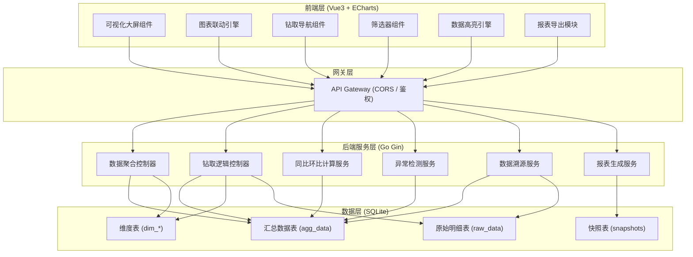
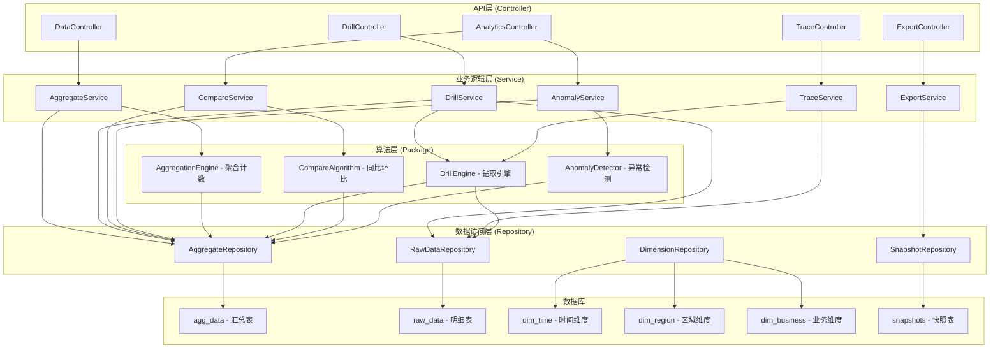
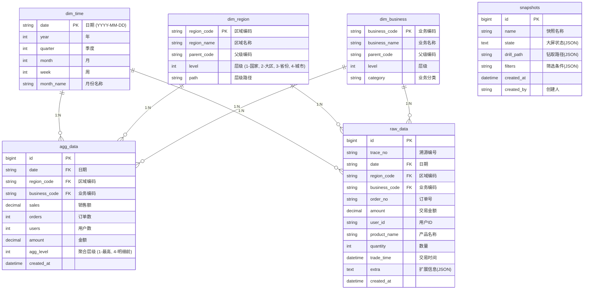

## 1. 架构设计



## 2. 技术描述

### 2.1 技术栈选型
- **前端框架**: Vue 3.4 + TypeScript + Vite 5
- **可视化库**: ECharts 5.5 (核心图表渲染)
- **状态管理**: Pinia (全局筛选状态、钻取路径管理)
- **路由**: Vue Router 4 (大屏/报表页面路由)
- **样式**: Tailwind CSS 3 + SCSS (暗黑科技风主题)
- **UI组件**: Element Plus (筛选器、弹窗等基础组件)
- **HTTP客户端**: Axios (API请求封装)

- **后端框架**: Go 1.22 + Gin 1.9
- **数据库驱动**: GORM 1.26 + go-sqlite3
- **数据处理**: 自定义聚合算法库
- **Excel导出**: excelize (Go语言Excel处理库)

- **数据库**: SQLite 3 (分层存储设计)
  - `agg_data`: 多层级预聚合数据，支持快速查询
  - `raw_data`: 原始明细数据，用于最终溯源
  - `dim_*`: 时间、区域、业务类型维度表
  - `snapshots`: 大屏快照存储

### 2.2 目录结构
```
hetong/
├── server/                     # Go后端
│   ├── cmd/
│   │   └── main.go            # 应用入口
│   ├── internal/
│   │   ├── controller/        # API控制器
│   │   ├── service/           # 业务逻辑层
│   │   ├── repository/        # 数据访问层
│   │   ├── model/             # 数据模型
│   │   └── middleware/        # 中间件
│   ├── pkg/
│   │   ├── drill/             # 钻取算法
│   │   ├── analytics/         # 同比环比/异常检测
│   │   └── export/            # 报表导出
│   ├── data/
│   │   └── dashboard.db       # SQLite数据库
│   ├── go.mod
│   └── build.sh               # 编译脚本
├── web/                        # Vue3前端
│   ├── src/
│   │   ├── components/        # 图表组件
│   │   ├── composables/       # 组合式函数
│   │   ├── stores/            # Pinia状态
│   │   ├── views/             # 页面视图
│   │   ├── api/               # API接口
│   │   ├── utils/             # 工具函数
│   │   └── styles/            # 全局样式
│   ├── package.json
│   ├── vite.config.ts
│   └── build.sh               # 构建脚本
└── deploy.sh                  # 一键部署脚本
```

## 3. 路由定义

### 3.1 前端路由
| 路由路径 | 页面名称 | 核心功能 |
|----------|----------|----------|
| `/` | 可视化大屏 | 主仪表盘，多图表联动展示 |
| `/dashboard` | 可视化大屏 | 同上（别名） |
| `/reports` | 报表中心 | 快照管理、报表导出 |
| `/trace` | 数据溯源 | 溯源链路可视化、明细查看 |

### 3.2 后端API路由
| Method | 路由路径 | 功能描述 |
|--------|----------|----------|
| GET | `/api/health` | 健康检查 |
| POST | `/api/data/aggregate` | 多层级数据聚合查询 |
| POST | `/api/data/drill` | 数据钻取（下钻/上卷） |
| POST | `/api/data/compare` | 同比环比计算 |
| POST | `/api/data/anomaly` | 异常数据检测 |
| POST | `/api/data/trace` | 数据溯源查询 |
| GET | `/api/dimensions` | 获取维度列表（时间/区域/业务） |
| POST | `/api/snapshots` | 保存大屏快照 |
| GET | `/api/snapshots` | 获取快照列表 |
| GET | `/api/snapshots/:id` | 获取快照详情 |
| POST | `/api/export/excel` | 导出Excel报表 |
| POST | `/api/export/pdf` | 导出PDF报表 |

## 4. API定义

### 4.1 核心数据类型定义

```typescript
// 层级维度定义
type DimensionLevel = 'time' | 'region' | 'business';

type DrillLevel = {
  dimension: DimensionLevel;
  value: string | null;
  label: string;
};

// 聚合查询请求
interface AggregateRequest {
  dimensions: DimensionLevel[];      // 聚合维度
  metrics: string[];                  // 指标列表
  filters: {
    timeRange?: [string, string];     // 时间范围
    regions?: string[];               // 区域筛选
    businessTypes?: string[];         // 业务类型筛选
  };
  drillPath: DrillLevel[];            // 当前钻取路径
}

// 聚合查询响应
interface AggregateResponse {
  data: Array<{
    dimensions: Record<DimensionLevel, string>;
    metrics: Record<string, number>;
    comparison?: {
      yoy: number;                     // 同比
      mom: number;                     // 环比
      yoyPercent: number;
      momPercent: number;
    };
    anomaly?: {
      isAnomaly: boolean;
      severity: 'low' | 'medium' | 'high';
      reason: string;
    };
    canDrillDown: boolean;
    nextDimension: DimensionLevel | null;
  }>;
  summary: {
    totalRecords: number;
    drillPath: DrillLevel[];
    availableDimensions: DimensionLevel[];
  };
}

// 数据溯源响应
interface TraceResponse {
  traceId: string;
  aggregatePath: Array<{
    level: string;
    filter: Record<string, any>;
    data: any;
  }>;
  rawData: Array<Record<string, any>>;
  totalRaw: number;
}
```

### 4.2 请求响应示例

**数据钻取请求**
```json
{
  "drillAction": "down",
  "currentPath": [
    {"dimension": "time", "value": "2025", "label": "2025年"}
  ],
  "drillDimension": "region",
  "drillValue": "华东",
  "metrics": ["sales", "orders", "users"]
}
```

**数据钻取响应**
```json
{
  "code": 0,
  "message": "success",
  "data": {
    "drillPath": [
      {"dimension": "time", "value": "2025", "label": "2025年"},
      {"dimension": "region", "value": "华东", "label": "华东地区"}
    ],
    "nextDimension": "business",
    "records": [
      {
        "dimensions": {"time": "2025", "region": "华东", "business": "零售"},
        "metrics": {"sales": 1250000, "orders": 8450, "users": 3200},
        "comparison": {"yoy": 15.3, "mom": 8.2},
        "anomaly": {"isAnomaly": false},
        "canDrillDown": true
      }
    ]
  }
}
```

## 5. 服务端架构



## 6. 数据模型

### 6.1 ER图



### 6.2 DDL语句

```sql
-- 时间维度表
CREATE TABLE IF NOT EXISTS dim_time (
    date TEXT PRIMARY KEY,
    year INTEGER NOT NULL,
    quarter INTEGER NOT NULL,
    month INTEGER NOT NULL,
    week INTEGER NOT NULL,
    month_name TEXT NOT NULL
);

-- 区域维度表
CREATE TABLE IF NOT EXISTS dim_region (
    region_code TEXT PRIMARY KEY,
    region_name TEXT NOT NULL,
    parent_code TEXT,
    level INTEGER NOT NULL,
    path TEXT NOT NULL,
    FOREIGN KEY (parent_code) REFERENCES dim_region(region_code)
);

-- 业务类型维度表
CREATE TABLE IF NOT EXISTS dim_business (
    business_code TEXT PRIMARY KEY,
    business_name TEXT NOT NULL,
    parent_code TEXT,
    level INTEGER NOT NULL,
    category TEXT NOT NULL,
    FOREIGN KEY (parent_code) REFERENCES dim_business(business_code)
);

-- 汇总数据表（分层聚合）
CREATE TABLE IF NOT EXISTS agg_data (
    id INTEGER PRIMARY KEY AUTOINCREMENT,
    date TEXT NOT NULL,
    region_code TEXT NOT NULL,
    business_code TEXT NOT NULL,
    sales REAL NOT NULL DEFAULT 0,
    orders INTEGER NOT NULL DEFAULT 0,
    users INTEGER NOT NULL DEFAULT 0,
    amount REAL NOT NULL DEFAULT 0,
    agg_level INTEGER NOT NULL,
    created_at DATETIME DEFAULT CURRENT_TIMESTAMP,
    FOREIGN KEY (date) REFERENCES dim_time(date),
    FOREIGN KEY (region_code) REFERENCES dim_region(region_code),
    FOREIGN KEY (business_code) REFERENCES dim_business(business_code)
);

CREATE INDEX idx_agg_data_level ON agg_data(agg_level);
CREATE INDEX idx_agg_data_date ON agg_data(date);
CREATE INDEX idx_agg_data_region ON agg_data(region_code);
CREATE INDEX idx_agg_data_business ON agg_data(business_code);
CREATE INDEX idx_agg_data_composite ON agg_data(agg_level, date, region_code, business_code);

-- 原始明细表
CREATE TABLE IF NOT EXISTS raw_data (
    id INTEGER PRIMARY KEY AUTOINCREMENT,
    trace_no TEXT NOT NULL UNIQUE,
    date TEXT NOT NULL,
    region_code TEXT NOT NULL,
    business_code TEXT NOT NULL,
    order_no TEXT NOT NULL,
    amount REAL NOT NULL,
    user_id TEXT NOT NULL,
    product_name TEXT NOT NULL,
    quantity INTEGER NOT NULL DEFAULT 1,
    trade_time DATETIME NOT NULL,
    extra TEXT,
    created_at DATETIME DEFAULT CURRENT_TIMESTAMP,
    FOREIGN KEY (date) REFERENCES dim_time(date),
    FOREIGN KEY (region_code) REFERENCES dim_region(region_code),
    FOREIGN KEY (business_code) REFERENCES dim_business(business_code)
);

CREATE INDEX idx_raw_date ON raw_data(date);
CREATE INDEX idx_raw_region ON raw_data(region_code);
CREATE INDEX idx_raw_business ON raw_data(business_code);
CREATE INDEX idx_raw_trace ON raw_data(trace_no);
CREATE INDEX idx_raw_composite ON raw_data(date, region_code, business_code);

-- 快照表
CREATE TABLE IF NOT EXISTS snapshots (
    id INTEGER PRIMARY KEY AUTOINCREMENT,
    name TEXT NOT NULL,
    state TEXT NOT NULL,
    drill_path TEXT NOT NULL,
    filters TEXT NOT NULL,
    created_at DATETIME DEFAULT CURRENT_TIMESTAMP,
    created_by TEXT DEFAULT 'system'
);

CREATE INDEX idx_snapshots_created ON snapshots(created_at);
```

### 6.3 初始化数据

为保证系统可正常运行，需要初始化：
1. 2024-2025年时间维度数据（按天）
2. 4级区域维度（全国→大区→省份→城市）
3. 3级业务类型维度（大类→中类→小类）
4. 模拟10万条原始交易数据
5. 预生成4级聚合数据（agg_level 1-4）
